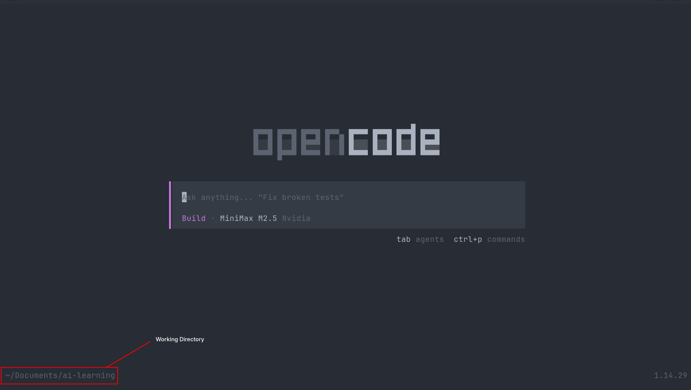

# Simple Use

This page will walk you through the basic use of OpenCode in TUI mode

### Selecting the Directory/Codebase

- First choose the directory or the codebase on which you want to work
- Copy the path of that directory
- Open the terminal in that directory by running the `cd` command

For example:

```bash
cd Documents/ai-learning/
```

### Starting the OpenCode

- Now start the OpenCode by just running `opencode` in the terminal
- You'll encounter this type of interface, make sure that your working directory is appearing on the left bottom of the interface

<figure markdown="span">
  [{ width="100%"}](../assets/opencode-tui.png)
  <figcaption>TUI of OpenCode</figcaption>
</figure>

### Selecting the Model

- You can select the models in multiple ways, the way that I like is typing the `/models`
- Then you can select your desirable model from the list of the models, for this example I'll use `MiniMax M2.5` model from NVIDIA

<video width="100%" controls>
  <source src="../assets/selecting-models.mp4" type="video/mp4">
  Your browser does not support the video tag.
</video>

### Changing the Modes

The OpenCode have two modes to work with:

1. **Planning** : Use this mode to plan something, this mode can't change your codebase and use for the planning purpose only.
2. **Build** : Use this mode when you are sure to make changes in the codebase, this mode will actually make the changes

- For general workflow you'll always use the Plan mode first to plan out the requirements or specification, once the model gives its response, and if you are satisfied with it, only then should you switch to Build mode and give the model instructions to move ahead with the plan. Otherwise, refine the plan according to your requirements.

- To change between modes you can press the `Tab`

<video width="100%" controls>
  <source src="../assets/changing-modes.mp4" type="video/mp4">
  Your browser does not support the video tag.
</video>

### Building the Portfolio Landing Page

I'll walk you through the example of building the simple portfolio landing page

**Step 1 : Give the prompt to the model as detailed as possible**
Giving a good prompt is a very fundamental thing if you want the model to work exactly as intended, this is example of the prompt that I gave to the model:

```markdown
**Role:** Act as an expert Frontend Web Developer and UI/UX Designer who specializes in creating ultra-minimalistic, elegant, and high-performance websites.

**Task:** Write the complete HTML, CSS, and Vanilla JavaScript code for a modern Software Developer's portfolio landing page. All code should be contained within a single `index.html` file (using `<style>` and `<script>` tags) for easy testing, or cleanly separated into standard files if preferred.

**Design & Aesthetic Guidelines:**

- **Style:** Minimalistic, elegant, and clean. Emphasize whitespace (negative space) and strong typography. No heavy shadows, gradients, or cluttered layouts.
- **Color Palette (Strictly Minimal):** Use a stark, monochromatic base with high contrast.
  - _Light Mode Base:_ Background `#FAFAFA`, Primary Text `#111111`, Subtext `#666666`.
  - _Dark Mode Base:_ Background `#121212`, Primary Text `#EDEDED`, Subtext `#A0A0A0`.
  - _Accent Color:_ A single, elegant accent color (e.g., a muted indigo `#6366F1` or pure `#000000`/`#FFFFFF` depending on the theme) for hover states and primary buttons.
- **Typography:** Use a clean, modern sans-serif web font (like 'Inter', 'Geist', or system-ui). Make headers bold and impactful, and paragraph text highly legible.

**Functional Requirements:**

- **Fully Responsive:** The layout must adapt flawlessly to mobile phones, tablets, and desktop screens using CSS Flexbox/Grid and media queries.
- **Light/Dark Mode Toggle:** Implement a functional theme toggle switch in the navigation bar using Vanilla JavaScript. The state should be saved to `localStorage` and default to the user's system preference. Use CSS variables (`:root`) for seamless theme switching.
- **Smooth Scrolling:** Clicking on navigation links should smoothly scroll to the respective sections.

**Content Structure (Landing Page Sections):**

1.  **Navigation Bar (Sticky):** Developer's Name or Logo on the left. Navigation links (About, Projects, Contact) and the Light/Dark Mode toggle icon on the right.
2.  **Hero Section:** Centered or left-aligned. A large, elegant greeting ("Hi, I'm [Name]."), a subheadline stating "Software Developer focused on building clean and scalable digital experiences.", and a minimalist CTA button (e.g., "View My Work" or "Download Resume").
3.  **Skills / Tech Stack:** A very subtle, text-based scrolling marquee or a simple grid of text tags outlining core technologies (e.g., JavaScript, React, Node.js, Python).
4.  **Featured Projects:** A 2-column grid (1 column on mobile) showing 2-4 projects. Project cards should have zero borders, relying on spacing or very subtle background differences. Include a placeholder image area, project title, a brief 1-sentence description, and simple "Live Demo" / "GitHub" text links.
5.  **Footer/Contact:** A highly reduced section at the bottom. A large text prompt saying "Let's work together", a clickable `mailto:` email link, and minimal social icons (GitHub, LinkedIn).

**Code Requirements:**

- Use semantic HTML5 tags (`<header>`, `<main>`, `<section>`, `<footer>`).
- Use modern CSS (Flexbox, Grid, CSS Variables).
- Ensure the JavaScript is clean and thoroughly commented, particularly the logic for the dark/light mode toggle.
- Please provide the complete, functional code.
```

**Step 2** : Run the prompt on the Plan mode and review the entire plan, if you are not satisfied, give it the specific instruction and run it again unless it gives proper plan according to your need

**Step 3**: After you are satisfied with the plan you can switch to the Build mode and give instruction to move ahead with the plan

<hr>

This is the result that I got after running this prompt:

<video width="100%" controls>
  <source src="../assets/portfolio-site.mp4" type="video/mp4">
  Your browser does not support the video tag.
</video>
