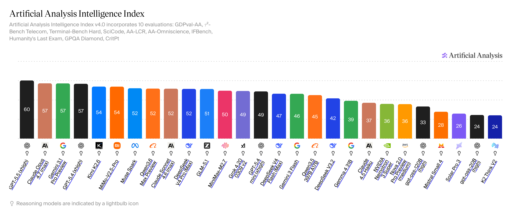
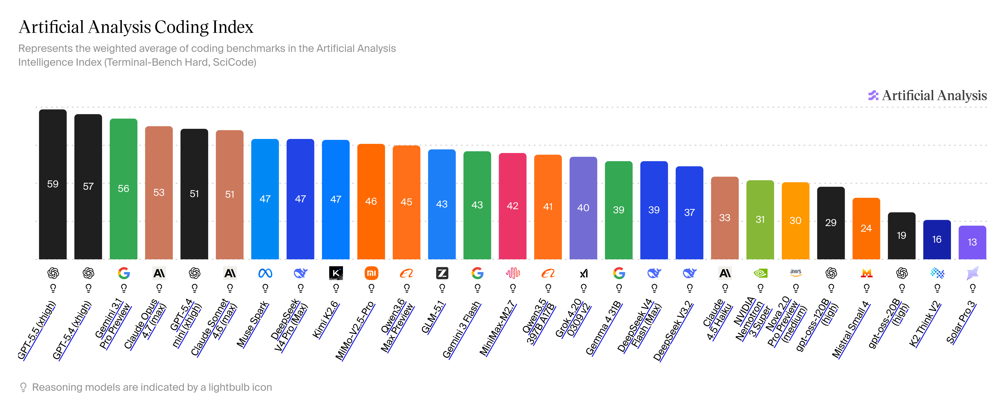
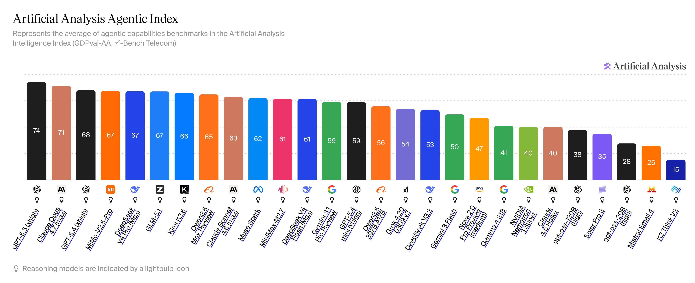

# Open Source Models

### The Question

I think this might bug a lot of people: what about the accuracy of open-source models? Are they really that accurate compared to other proprietary models like Claude, ChatGPT, etc.?

The honest answer is no, but! It doesn't mean they're useless. They perform significantly better than the models you use on a daily basis, what do I mean? well for example if you have Claude Code, you don't use the Claude Opus max version for all of your tasks right? you use the Sonnet or lighter version most of the time, and some of the open source models do actually beat them in benchmarks.

These are some of the benchmarks as per the [Artificial Analysis](https://artificialanalysis.ai) on 29th April 2026

**Intelligence Index**

<figure markdown="span">
  [{ width="100%"}](../assets/intelligence-index.png)
  <figcaption>Intelligence Index of Models</figcaption>
</figure>

**Coding Index**

<figure markdown="span">
  [{ width="100%"}](../assets/coding-index.png)
  <figcaption>Coding Index of Models</figcaption>
</figure>

**Agentic Index**

<figure markdown="span">
  [{ width="100%"}](../assets/agentic-index.png)
  <figcaption>Agentic Index of Models</figcaption>
</figure>

As you can see from the benchmarks that some open source models like Kimi K2.6, GLM 5.1, MiMo-V2.5 Pro, Qwen3.6 Max and MiniMax-M2.7 are on par with or exceed day-to-day proprietary models.

### Why To Use Open Models

This is also a common question: why should we use open models? Well! Open-source models are cheap compared to their closed-source alternatives and that solely because they're "open", means anyone can download and host these models so the overall cost using the models automatically becomes less.

One more thing that might attract you (that attracted me) is to see that how much they're capable compare to their competitors like Claude, Gemini or ChatGPT, the research they had done to make a models more cost efficient but also effective is interesting to look at, I will like to add some of the articles regarding the same to read

- [DeepSeek-Coder-V2: Breaking the Barrier of Closed-Source Models in Code Intelligence](https://arxiv.org/pdf/2406.11931)
- [ Welcome Gemma 4: Frontier multimodal intelligence on device](https://huggingface.co/blog/gemma4)
- [DeepSeek-V2: A Strong, Economical, and Efficient Mixture-of-Experts Language Model](https://arxiv.org/pdf/2405.04434)
- [DeepSeek-R1: Incentivizing Reasoning Capability in LLMs via Reinforcement Learning](https://arxiv.org/pdf/2501.12948)
- [ATTENTION RESIDUALS](https://arxiv.org/pdf/2603.15031)

### How To Use Open Models

Many of the best open source models are available in the [[Nvidia/Introduction|NVIDIA NIM]], you can use it directly from there but there are some constraint to keep in mind while using those models

- You need to be as specific as possible, the reason for that is, they don't generally have any "pre-uploaded" system prompts unlike [other providers](https://thoughts.jock.pl/p/claude-code-source-leak-what-to-learn-ai-agents-2026).
- You need to identify that when to use which models, these are some models models with proven benchmarks:

!!! note

    Use **Gemma 4 31B** as a default model because it tends to give consistent output in coding related tasks.

##### MiniMax Family (Excellent for coding)

- MiniMax-M2.7
- MiniMax-M2.5

##### Kimi Family (Excellent for coding/ general tasks)

- Kimi K2.6
- Kimi K2.5

##### GLM Family (Excellent for coding/ general tasks)

- GLM 5.1
- GLM 5

##### Other Good Models

- Qwen 3.6
- DeepSeek v4.0
- Google Gemma 4 31B IT
